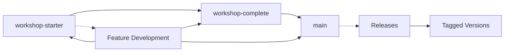

# Branch Strategy Guide

This document outlines the **two-branch strategy** used in the Angular Shopping Cart Workshop to provide a streamlined and effective learning experience across different implementation stages.

## 🌿 Branch Overview

### Branch Architecture

```
main (development and final version)
├── workshop-complete (full solution with educational comments)
└── workshop-starter (educational skeleton code with TODOs)
```

Each branch serves a specific purpose in the learning journey:

| Branch | Purpose | Target Audience | Status |
|--------|---------|----------------|--------|
| `workshop-starter` | Educational skeleton with TODOs | Workshop participants | ✅ Polished |
| `workshop-complete` | Complete solutions with educational comments | Self-learners & instructors | ✅ Ready |
| `main` | Development and stable branch | Developers & maintainers | ✅ Active |

## 📚 Detailed Branch Descriptions

### 1. `workshop-starter` (Educational Branch)

**Purpose**: Provides skeleton code with educational TODOs and hints for workshop participants.

**Characteristics:**
- ✅ Complete UI components and templates
- ✅ Service skeletons with TODO comments
- ✅ Type definitions and interfaces
- ✅ Test files with expected behavior
- ❌ No business logic implementation
- ❌ Services return minimal data for compilation

**Example Structure:**
```typescript
// shopping-cart-rxjs.service.ts
export class ShoppingCartRxjsService {
  private itemsSubject = new BehaviorSubject<CartItem[]>([]);
  items$ = this.itemsSubject.asObservable();
  
  constructor() {
    // TODO: Load items from localStorage if available
    // TODO: Auto-update total when items change
  }
  
  addItem(product: Product): void {
    // TODO: Implement add item logic
    // HINT: Check if item exists, update quantity or add new item
    // HINT: Update BehaviorSubject and save to localStorage
  }
  
  // More TODO methods...
}
```

**Educational Features:**
- Comprehensive TODO comments with implementation hints
- Step-by-step guided learning path
- Progressive complexity across workshop levels
- Clear separation between UI and business logic

### 2. `workshop-complete` (Solution Branch)

**Purpose**: Complete implementation with comprehensive educational comments and full business logic.

**Characteristics:**
- ✅ **Full business logic implementation** for all 6 workshop modules
- ✅ **Comprehensive educational comments** explaining patterns and decisions
- ✅ **Best practice examples** with modern Angular patterns
- ✅ **Progressive learning implementation** from basic RxJS to advanced signals
- ✅ **Enterprise-grade features** including analytics, validation, and error handling
- ✅ **Performance optimizations** and memory management patterns
- ✅ **Modern Angular features** including signals, computed values, effects, and Resource API

**Example Structure:**
```typescript
// shopping-cart-rxjs.service.ts
export class ShoppingCartRxjsService {
  private itemsSubject = new BehaviorSubject<CartItem[]>([]);
  items$ = this.itemsSubject.asObservable();
  
  constructor() {
    // Load persisted cart data on service initialization
    this.loadCartFromStorage();
    
    // Set up reactive total calculation - demonstrates RxJS patterns
    this.items$.subscribe(items => {
      const total = this.calculateTotal(items);
      this.totalSubject.next(total);
    });
  }
  
  /**
   * Adds a product to the cart, handling both new items and quantity updates
   * Demonstrates immutable state updates and BehaviorSubject patterns
   */
  addItem(product: Product): void {
    const currentItems = this.itemsSubject.value;
    const existingItem = currentItems.find(item => item.productId === product.id);
    
    if (existingItem) {
      // Update existing item quantity - immutable approach
      this.updateQuantity(product.id, existingItem.quantity + 1);
    } else {
      // Add new item to cart - create new array to maintain immutability
      const newItem: CartItem = {
        id: this.generateId(),
        productId: product.id,
        name: product.name,
        price: product.price,
        quantity: 1,
        image: product.image,
        category: product.category,
        discount: product.discount
      };
      
      const updatedItems = [...currentItems, newItem];
      this.itemsSubject.next(updatedItems);
      this.saveCartToStorage();
    }
  }
  
  // More implemented methods with educational comments...
}
```

**Educational Value:**
- Real-world implementation patterns
- Performance optimization examples
- Error handling best practices
- Comprehensive test coverage
- Documentation of design decisions

### 3. `main` (Development Branch)

**Purpose**: Active development branch and stable reference implementation.

**Characteristics:**
- ✅ **Latest stable code** with all features
- ✅ **Development coordination** for contributors
- ✅ **Integration testing** and CI/CD workflows
- ✅ **Documentation updates** and maintenance
- ✅ **Issue tracking** and feature development
- ✅ **Release preparation** and version management

**Example Structure:**
```typescript
// advanced-cart.service.ts
@Injectable({ providedIn: 'root' })
export class AdvancedCartService {
  private readonly cartState = signal<CartState>({
    items: [],
    lastUpdated: new Date(),
    version: 1,
    sessionId: this.generateSessionId()
  });

  private readonly errorHandler = inject(ErrorHandler);
  private readonly analytics = inject(AnalyticsService);
  private readonly logger = inject(LoggerService);

  constructor() {
    this.initializeService();
    this.setupEffects();
    this.setupErrorRecovery();
  }

  private initializeService(): void {
    try {
      this.loadCartFromStorage();
      this.analytics.trackEvent('cart_service_initialized');
    } catch (error) {
      this.errorHandler.handleError(error);
      this.initializeEmptyCart();
    }
  }

  private setupEffects(): void {
    // Auto-save with debouncing for performance
    effect(() => {
      const items = this.cartItems();
      debounceTime(500)(() => {
        this.saveCartToStorage();
        this.analytics.trackEvent('cart_updated', { itemCount: items.length });
      });
    });

    // Performance monitoring
    effect(() => {
      const metrics = this.cartMetrics();
      this.logger.logPerformanceMetrics(metrics);
    });
  }

  // Production-grade methods with comprehensive error handling...
}
```

**Enterprise Features:**
- Comprehensive error boundaries
- Performance monitoring
- Analytics integration
- Security considerations
- Scalability patterns

## 🎯 **New Streamlined Strategy Benefits**

### Why Two Branches Work Better:

1. **Simplified Learning Path**: Clear progression from starter with TODOs to complete solutions
2. **Reduced Maintenance Overhead**: Fewer branches to keep synchronized and updated
3. **Focused Educational Value**: Each branch has a clear, distinct purpose
4. **Easier Navigation**: Students and instructors can easily switch between starter and complete
5. **Better Resource Allocation**: More time for quality implementations rather than branch management

### Branch Synchronization Strategy:

- **workshop-starter**: Contains comprehensive TODOs and educational skeleton code
- **workshop-complete**: Contains full implementations with detailed educational comments
- **main**: Serves as the development coordination branch for contributors

## 🔄 Branch Workflow

### Development Process



### Applying Changes Across Branches

When implementing new features or fixes:

1. **Start with `workshop-starter`**: Implement comprehensive educational TODOs and skeleton code
2. **Complete in `workshop-complete`**: Add full implementation with detailed educational comments
3. **Coordinate in `main`**: Merge stable changes and coordinate development efforts
4. **Release**: Tag stable versions for workshop distribution

### Change Propagation Strategy

**For Layout Improvements (Example):**

```bash
# 1. Implement in workshop-starter
git checkout workshop-starter
# Make layout changes...
git commit -m "Implement 3-column cart layout redesign"

# 2. Apply to workshop-complete
git checkout workshop-complete
git cherry-pick <commit-hash>
# Implement full functionality with educational comments
git commit -m "Apply 3-column layout with complete implementation"

# 3. Coordinate in main
git checkout main
git merge workshop-complete
# Resolve any conflicts and coordinate
git commit -m "Merge stable layout improvements"
```

## 📋 Branch Maintenance

### Consistency Checklist

When updating branches, ensure:

**Code Consistency:**
- ✅ Same HTML structure across all branches
- ✅ Consistent CSS classes and styling
- ✅ Identical component interfaces
- ✅ Same responsive breakpoints
- ✅ Consistent accessibility features

**Educational Progression:**
- ✅ `workshop-starter` has appropriate TODOs
- ✅ `workshop-complete` has educational comments
- ✅ `production-ready` has enterprise patterns
- ✅ `main` has clean, polished code

**Testing Alignment:**
- ✅ All branches pass their respective test suites
- ✅ Same functional behavior across implementations
- ✅ Performance benchmarks meet targets
- ✅ Accessibility standards maintained

### Quality Gates

Each branch must meet specific quality criteria:

**workshop-starter:**
- ✅ **TypeScript compilation** without errors
- ✅ **UI renders correctly** with skeleton functionality
- ✅ **Comprehensive TODO comments** with implementation hints and learning objectives
- ✅ **Educational progression** verified across all 6 modules
- ✅ **Consistent service structure** with proper skeleton implementations

**workshop-complete:**
- ✅ **All functionality working correctly** across all workshop modules
- ✅ **Comprehensive business logic** with progressive taxation, analytics, and validation
- ✅ **Educational comments** explaining patterns, decisions, and best practices
- ✅ **Modern Angular patterns** including signals, computed values, effects, and Resource API
- ✅ **Performance optimizations** and memory management
- ✅ **Error handling and validation** with user-friendly feedback

**main:**
- ✅ **Stable integration** of both starter and complete branches
- ✅ **Documentation accuracy** and completeness
- ✅ **CI/CD workflows** functioning correctly
- ✅ **Release readiness** with proper tagging and versioning

## 🚀 Deployment Strategy

### Branch-Specific Deployments

| Branch | Deployment Target | Purpose |
|--------|------------------|---------|
| `workshop-starter` | Workshop Environment | Student development and hands-on learning |
| `workshop-complete` | Reference Environment | Instructor demonstrations and self-paced learning |
| `main` | Development Environment | Continuous integration and coordination |

### Automated Deployments

```yaml
# .github/workflows/deploy.yml
name: Two-Branch Deployment

on:
  push:
    branches: [ main, workshop-complete, workshop-starter ]

jobs:
  deploy:
    runs-on: ubuntu-latest
    steps:
      - name: Deploy workshop-starter
        if: github.ref == 'refs/heads/workshop-starter'
        run: |
          echo "Deploying workshop starter environment"
          deploy-to-workshop-env.sh
        
      - name: Deploy workshop-complete
        if: github.ref == 'refs/heads/workshop-complete'
        run: |
          echo "Deploying reference solution environment"
          deploy-to-reference-env.sh
        
      - name: Deploy main
        if: github.ref == 'refs/heads/main'
        run: |
          echo "Deploying development coordination environment"
          deploy-to-dev-env.sh
```

## 🔍 Troubleshooting

### Common Branch Issues

**Merge Conflicts:**
```bash
# When conflicts arise during updates
git checkout workshop-complete
git merge workshop-starter
# Resolve conflicts maintaining educational comments
git commit -m "Resolve merge conflicts - preserve educational value"
```

**Inconsistent Features:**
```bash
# Verify feature parity across branches
./scripts/verify-branch-consistency.sh
```

**Performance Regression:**
```bash
# Run performance tests across branches
npm run test:performance:all-branches
```

### Branch Synchronization

```bash
# Script to synchronize common changes across branches
#!/bin/bash
CHANGE_COMMIT="$1"
BRANCHES=("workshop-complete" "main")

for branch in "${BRANCHES[@]}"; do
  git checkout $branch
  git cherry-pick $CHANGE_COMMIT
  # Apply branch-specific modifications
  ./scripts/adapt-for-branch.sh $branch
  git commit --amend -m "Adapt changes for $branch context"
done

echo "✅ Changes synchronized across workshop branches"
echo "📋 Next: Review and test implementations in each branch"
```

## 🆕 New Workshop Modules

### Recently Added Modules

The workshop has been expanded with three new topic-based modules that complement the existing progressive learning path:

**Topic-Based Learning Modules:**
- **Control Flow** (`docs/CONTROL_FLOW.md`) - Modern Angular template syntax (@if, @for, @switch, @defer)
- **Standalone Components** (`docs/STANDALONE.md`) - Module-free architecture and modern routing
- **Modern DI with inject()** (`docs/INJECT.md`) - Advanced dependency injection patterns

**Module Integration:**
- All new modules are included across both branches (workshop-starter, workshop-complete)
- Each module has its own directory structure: `src/app/{control-flow,standalone,inject}/`
- Routes are configured for lazy loading: `/control-flow`, `/standalone`, `/inject`
- Documentation follows the same comprehensive format as existing levels

**Branch Consistency:**
All new modules maintain the same branch philosophy:
- `workshop-starter`: Comprehensive TODO comments and skeleton implementations with educational hints
- `workshop-complete`: Full solutions with detailed educational comments and modern Angular patterns
- `main`: Coordination branch for development and stable releases

## 📈 Future Considerations

### Scaling the Two-Branch Strategy

As the workshop evolves:

1. **Feature Branches**: Temporary branches for developing new workshop modules
2. **Version Tags**: Semantic versioning for stable workshop releases
3. **Experimental Features**: Testing new Angular features in dedicated feature branches
4. **Localization Support**: Language-specific documentation without separate branches
5. **Community Contributions**: Streamlined PR process with clear branch targeting

### Automation Opportunities

1. **Automated Branch Sync**: Scripts to propagate changes
2. **Quality Gates**: Automated testing and validation
3. **Documentation Generation**: Auto-update docs from code
4. **Performance Monitoring**: Continuous performance tracking

---

## ✅ **Implementation Status**

**workshop-starter:** ✅ **Fully Polished**
- All 6 services have consistent TODO structure with comprehensive educational hints
- Route configurations verified and working
- Compilation tested successfully
- Ready for workshop participants

**workshop-complete:** ✅ **Fully Implemented**
- All TODO methods implemented with full business logic
- Comprehensive educational comments explaining modern Angular patterns
- Enterprise-grade features including analytics, validation, and error handling
- Progressive taxation, bulk discounts, import/export functionality
- Modern Angular patterns: signals, computed values, effects, Resource API
- Ready for instructors and self-paced learners

**main:** ✅ **Active Development**
- Coordination branch for ongoing development
- Integration of stable features from workshop branches
- Documentation maintenance and updates

---

**🎆 Achievement:** Successfully transitioned from 4-branch complexity to streamlined 2-branch strategy!

**🚀 Next Steps:** The workshop is now production-ready with comprehensive educational content across all 6 modules.