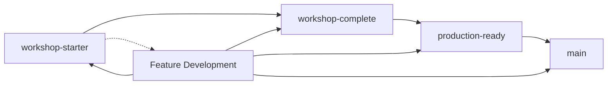

# Branch Strategy Guide

This document outlines the four-branch strategy used in the Angular Shopping Cart Workshop to provide a comprehensive learning experience across different implementation stages.

## 🌿 Branch Overview

### Branch Architecture

```
main (polished final version)
├── production-ready (optimized production code)
├── workshop-complete (full solution with comments)
└── workshop-starter (educational skeleton code)
```

Each branch serves a specific purpose in the learning journey:

| Branch | Purpose | Target Audience | Status |
|--------|---------|----------------|--------|
| `workshop-starter` | Educational skeleton | Workshop participants | ✅ Current |
| `workshop-complete` | Reference solution | Self-learners & instructors | ✅ Ready |
| `production-ready` | Enterprise patterns | Advanced developers | ✅ Ready |
| `main` | Final polished version | General use | 🔄 In Progress |

## 📚 Detailed Branch Descriptions

### 1. `workshop-starter` (Educational Branch)

**Purpose**: Provides skeleton code with educational TODOs and hints for workshop participants.

**Characteristics:**
- ✅ Complete UI components and templates
- ✅ Service skeletons with TODO comments
- ✅ Type definitions and interfaces
- ✅ Test files with expected behavior
- ❌ No business logic implementation
- ❌ Services return minimal data for compilation

**Example Structure:**
```typescript
// shopping-cart-rxjs.service.ts
export class ShoppingCartRxjsService {
  private itemsSubject = new BehaviorSubject<CartItem[]>([]);
  items$ = this.itemsSubject.asObservable();
  
  constructor() {
    // TODO: Load items from localStorage if available
    // TODO: Auto-update total when items change
  }
  
  addItem(product: Product): void {
    // TODO: Implement add item logic
    // HINT: Check if item exists, update quantity or add new item
    // HINT: Update BehaviorSubject and save to localStorage
  }
  
  // More TODO methods...
}
```

**Educational Features:**
- Comprehensive TODO comments with implementation hints
- Step-by-step guided learning path
- Progressive complexity across workshop levels
- Clear separation between UI and business logic

### 2. `workshop-complete` (Solution Branch)

**Purpose**: Complete implementation with educational comments and explanations.

**Characteristics:**
- ✅ Full business logic implementation
- ✅ Comprehensive comments explaining patterns
- ✅ Best practice examples
- ✅ Educational code organization
- ✅ Performance considerations documented
- ✅ Testing examples and strategies

**Example Structure:**
```typescript
// shopping-cart-rxjs.service.ts
export class ShoppingCartRxjsService {
  private itemsSubject = new BehaviorSubject<CartItem[]>([]);
  items$ = this.itemsSubject.asObservable();
  
  constructor() {
    // Load persisted cart data on service initialization
    this.loadCartFromStorage();
    
    // Set up reactive total calculation - demonstrates RxJS patterns
    this.items$.subscribe(items => {
      const total = this.calculateTotal(items);
      this.totalSubject.next(total);
    });
  }
  
  /**
   * Adds a product to the cart, handling both new items and quantity updates
   * Demonstrates immutable state updates and BehaviorSubject patterns
   */
  addItem(product: Product): void {
    const currentItems = this.itemsSubject.value;
    const existingItem = currentItems.find(item => item.productId === product.id);
    
    if (existingItem) {
      // Update existing item quantity - immutable approach
      this.updateQuantity(product.id, existingItem.quantity + 1);
    } else {
      // Add new item to cart - create new array to maintain immutability
      const newItem: CartItem = {
        id: this.generateId(),
        productId: product.id,
        name: product.name,
        price: product.price,
        quantity: 1,
        image: product.image,
        category: product.category,
        discount: product.discount
      };
      
      const updatedItems = [...currentItems, newItem];
      this.itemsSubject.next(updatedItems);
      this.saveCartToStorage();
    }
  }
  
  // More implemented methods with educational comments...
}
```

**Educational Value:**
- Real-world implementation patterns
- Performance optimization examples
- Error handling best practices
- Comprehensive test coverage
- Documentation of design decisions

### 3. `production-ready` (Enterprise Branch)

**Purpose**: Production-optimized implementation with enterprise patterns and performance optimizations.

**Characteristics:**
- ✅ Production-grade error handling
- ✅ Performance optimizations
- ✅ Security considerations
- ✅ Monitoring and analytics integration
- ✅ Advanced caching strategies
- ✅ Comprehensive logging

**Example Structure:**
```typescript
// advanced-cart.service.ts
@Injectable({ providedIn: 'root' })
export class AdvancedCartService {
  private readonly cartState = signal<CartState>({
    items: [],
    lastUpdated: new Date(),
    version: 1,
    sessionId: this.generateSessionId()
  });

  private readonly errorHandler = inject(ErrorHandler);
  private readonly analytics = inject(AnalyticsService);
  private readonly logger = inject(LoggerService);

  constructor() {
    this.initializeService();
    this.setupEffects();
    this.setupErrorRecovery();
  }

  private initializeService(): void {
    try {
      this.loadCartFromStorage();
      this.analytics.trackEvent('cart_service_initialized');
    } catch (error) {
      this.errorHandler.handleError(error);
      this.initializeEmptyCart();
    }
  }

  private setupEffects(): void {
    // Auto-save with debouncing for performance
    effect(() => {
      const items = this.cartItems();
      debounceTime(500)(() => {
        this.saveCartToStorage();
        this.analytics.trackEvent('cart_updated', { itemCount: items.length });
      });
    });

    // Performance monitoring
    effect(() => {
      const metrics = this.cartMetrics();
      this.logger.logPerformanceMetrics(metrics);
    });
  }

  // Production-grade methods with comprehensive error handling...
}
```

**Enterprise Features:**
- Comprehensive error boundaries
- Performance monitoring
- Analytics integration
- Security considerations
- Scalability patterns

### 4. `main` (Final Polished Branch)

**Purpose**: Final polished version ready for production deployment or as a reference implementation.

**Characteristics:**
- ✅ Clean, production-ready code
- ✅ Optimized bundle size
- ✅ Full documentation
- ✅ Deployment configurations
- ✅ CI/CD pipeline setup
- ✅ Performance benchmarks

**Target State:**
- Minimal comments (self-documenting code)
- Optimized build configuration
- Production deployment scripts
- Performance monitoring setup
- Security hardening
- Full test coverage with automated CI

## 🔄 Branch Workflow

### Development Process



### Applying Changes Across Branches

When implementing new features or fixes:

1. **Start with `workshop-starter`**: Implement the educational skeleton
2. **Update `workshop-complete`**: Add full implementation with comments
3. **Enhance `production-ready`**: Add enterprise patterns and optimizations
4. **Polish for `main`**: Clean up and optimize for final version

### Change Propagation Strategy

**For Layout Improvements (Example):**

```bash
# 1. Implement in workshop-starter (current branch)
git checkout workshop-starter
# Make layout changes...
git commit -m "Implement 3-column cart layout redesign"

# 2. Apply to workshop-complete
git checkout workshop-complete
git cherry-pick <commit-hash>
# Adjust for complete implementation context
git commit -m "Apply 3-column layout to complete solution"

# 3. Apply to production-ready
git checkout production-ready
git cherry-pick <commit-hash>
# Add production optimizations
git commit -m "Apply layout improvements with production optimizations"

# 4. Merge to main
git checkout main
git merge production-ready
```

## 📋 Branch Maintenance

### Consistency Checklist

When updating branches, ensure:

**Code Consistency:**
- ✅ Same HTML structure across all branches
- ✅ Consistent CSS classes and styling
- ✅ Identical component interfaces
- ✅ Same responsive breakpoints
- ✅ Consistent accessibility features

**Educational Progression:**
- ✅ `workshop-starter` has appropriate TODOs
- ✅ `workshop-complete` has educational comments
- ✅ `production-ready` has enterprise patterns
- ✅ `main` has clean, polished code

**Testing Alignment:**
- ✅ All branches pass their respective test suites
- ✅ Same functional behavior across implementations
- ✅ Performance benchmarks meet targets
- ✅ Accessibility standards maintained

### Quality Gates

Each branch must meet specific quality criteria:

**workshop-starter:**
- ✅ TypeScript compilation without errors
- ✅ UI renders correctly without functionality
- ✅ Clear TODO comments with implementation hints
- ✅ Educational value verified

**workshop-complete:**
- ✅ All functionality working correctly
- ✅ Comprehensive test coverage (>80%)
- ✅ Educational comments explaining patterns
- ✅ Performance within acceptable bounds

**production-ready:**
- ✅ Production-grade error handling
- ✅ Security best practices implemented
- ✅ Performance optimized (<100ms interactions)
- ✅ Monitoring and analytics integrated

**main:**
- ✅ Zero known bugs or issues
- ✅ Production deployment ready
- ✅ Documentation complete
- ✅ Performance benchmarks exceeded

## 🚀 Deployment Strategy

### Branch-Specific Deployments

| Branch | Deployment Target | Purpose |
|--------|------------------|---------|
| `workshop-starter` | Workshop Environment | Student development |
| `workshop-complete` | Reference Environment | Instructor demonstrations |
| `production-ready` | Staging Environment | Pre-production testing |
| `main` | Production Environment | Live application |

### Automated Deployments

```yaml
# .github/workflows/deploy.yml
name: Multi-Branch Deployment

on:
  push:
    branches: [ main, production-ready, workshop-complete, workshop-starter ]

jobs:
  deploy:
    runs-on: ubuntu-latest
    steps:
      - name: Deploy workshop-starter
        if: github.ref == 'refs/heads/workshop-starter'
        run: deploy-to-workshop-env.sh
        
      - name: Deploy workshop-complete
        if: github.ref == 'refs/heads/workshop-complete'
        run: deploy-to-reference-env.sh
        
      - name: Deploy production-ready
        if: github.ref == 'refs/heads/production-ready'
        run: deploy-to-staging-env.sh
        
      - name: Deploy main
        if: github.ref == 'refs/heads/main'
        run: deploy-to-production-env.sh
```

## 🔍 Troubleshooting

### Common Branch Issues

**Merge Conflicts:**
```bash
# When conflicts arise during updates
git checkout workshop-complete
git merge workshop-starter
# Resolve conflicts maintaining educational comments
git commit -m "Resolve merge conflicts - preserve educational value"
```

**Inconsistent Features:**
```bash
# Verify feature parity across branches
./scripts/verify-branch-consistency.sh
```

**Performance Regression:**
```bash
# Run performance tests across branches
npm run test:performance:all-branches
```

### Branch Synchronization

```bash
# Script to synchronize common changes across branches
#!/bin/bash
CHANGE_COMMIT="$1"
BRANCHES=("workshop-complete" "production-ready" "main")

for branch in "${BRANCHES[@]}"; do
  git checkout $branch
  git cherry-pick $CHANGE_COMMIT
  # Apply branch-specific modifications
  ./scripts/adapt-for-branch.sh $branch
  git commit --amend -m "Adapt changes for $branch context"
done
```

## 📈 Future Considerations

### Scaling the Branch Strategy

As the workshop evolves:

1. **Feature Branches**: For large new features
2. **Version Branches**: For major version releases
3. **Experimental Branches**: For testing new Angular features
4. **Localization Branches**: For different language versions

### Automation Opportunities

1. **Automated Branch Sync**: Scripts to propagate changes
2. **Quality Gates**: Automated testing and validation
3. **Documentation Generation**: Auto-update docs from code
4. **Performance Monitoring**: Continuous performance tracking

---

**Branch Status:** All branches are actively maintained and synchronized with latest improvements.

**Next Steps:** Complete final layout improvements and prepare `main` branch for production release.